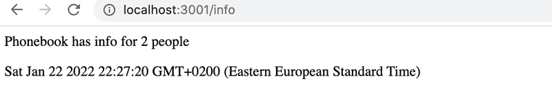

# FullStackOpenPart3

## Backend de la agenda telefónica

https://fullstackopenbackendphonebook.onrender.com

### Paso 1
Implemente una aplicación Node que devuelva una lista hardcodeada de entradas de la agenda   telefónica desde la dirección http://localhost:3001/api/persons.

La aplicación debe iniciarse con el comando npm start.

La aplicación también debe ofrecer un comando npm run dev que ejecutará la aplicación y reiniciará el servidor siempre que se realicen cambios y se guarden en un archivo en el código fuente.

### Paso 2

Implemente una página en la dirección http://localhost:3001/info que se parezca más o menos a esto:



La página tiene que mostrar la hora en que se recibió la solicitud y cuántas entradas hay en la agenda telefónica en el momento de procesar la solicitud.

### Paso 3

Implemente la funcionalidad para mostrar la información de una sola entrada de la agenda. La URL para obtener los datos de una persona con la identificación 5 debe ser http://localhost:3001/api/persons/5

Si no se encuentra una entrada para la identificación dada, el servidor debe responder con el código de estado apropiado.

### Paso 4

Implemente la funcionalidad que hace posible eliminar una sola entrada de la agenda telefónica mediante una solicitud HTTP DELETE a la URL única de esa entrada de la agenda.

Pruebe que su funcionalidad funcione con Postman o el cliente REST de Visual Studio Code.

### Paso 5

Expanda el backend para que se puedan agregar nuevas entradas a la agenda telefónica realizando solicitudes HTTP POST a la dirección http://localhost:3001/api/persons.

Genere una nueva id para la entrada de la agenda con la función Math.random. Use un rango lo suficientemente grande para sus valores aleatorios de modo que la probabilidad de crear identificadores duplicados sea pequeña.

### Paso 6

Implemente el manejo de errores para crear nuevas entradas. No se permite que la solicitud se realice correctamente si:
- Falta el nombre o número
- El nombre ya existe en la agenda

Responda a solicitudes como estas con el código de estado apropiado y también envíe información que explique el motivo del error, por ejemplo:

```javascript
 { error: 'name must be unique' } 
```

### Paso 7

Agregue el middleware morgan a su aplicación para el registro de mensajes. Configúrelo para registrar mensajes en su consola según la configuración tiny.

La documentación de Morgan no es la mejor y es posible que deba dedicar algún tiempo a averiguar cómo configurarla correctamente. Sin embargo, la mayor parte de la documentación del mundo cae en la misma categoría, por lo que es bueno aprender a descifrar e interpretar documentación críptica en cualquier caso.

Morgan se instala como todas las demás bibliotecas con el comando npm install. La puesta en funcionamiento de Morgan ocurre de la misma manera que la configuración de cualquier otro middleware mediante el comando app.use.

### Paso 8 

Configure morgan para que también muestre los datos enviados en las solicitudes HTTP POST:


Tenga en cuenta que el registro de datos incluso en la consola puede ser peligroso, ya que puede contener datos confidenciales y puede violar la ley de privacidad local (por ejemplo, GDPR en la UE) o el estándar comercial. En este ejercicio, no tiene que preocuparse por los problemas de privacidad, pero en la práctica, intente no registrar ningún dato sensible.

Este ejercicio puede resultar bastante complicado, aunque la solución no requiere mucho código.

Este ejercicio se puede completar de diferentes formas. Una de las posibles soluciones utiliza estas dos técnicas:

- creando nuevos tokens
- JSON.stringify

### Paso 9

Haga que el backend funcione con el frontend de la parte anterior. No implemente todavía la funcionalidad para realizar cambios en los números de teléfono, que se implementará en el ejercicio 3.17.

Probablemente tendrá que hacer algunos pequeños cambios en el frontend, al menos en las URL del backend. Recuerde mantener abierta la consola del desarrollador en su navegador. Si algunas solicitudes HTTP fallan, debe verificar en la pestaña Network qué está sucediendo. Vigile también la consola del backend. Si no hiciste el ejercicio anterior, vale la pena imprimir los datos de la solicitud o request.body en la consola en el manejador de eventos responsable de las solicitudes POST.

### Paso 10

Implemente el backend en Internet, por ejemplo en Heroku.

Pruebe el backend implementado con un navegador y un cliente REST de Postman o VS Code para asegurarse de que funcione.

PRO TIP: Cuando implementes tu aplicación en Heroku, vale la pena al menos al principio estar atento a los logs de la aplicación heroku EN TODO MOMENTO con el comando heroku logs -t.

El siguiente es un log sobre un problema típico. Heroku no puede encontrar la dependencia de la aplicación express:


La razón es que el paquete express no se ha instalado con el comando npm install express, por lo que la información sobre la dependencia no se guardó en el archivo package.json.

Otro problema típico es que la aplicación no está configurada para usar el puerto configurado para la variable de entorno PORT:


Cree un README.md en la raíz de su repositorio y agregue un enlace a su aplicación en línea.

### Paso 11

Genere una compilación de producción de su frontend y agréguela a la aplicación de Internet utilizando el método presentado en esta parte.

NB Asegúrese de que el directorio de build no esté ignorada en gitignore

También asegúrese de que el frontend todavía funcione localmente.

### Ejercicio 3.12

Cree una base de datos MongoDB basada en la nube para la aplicación de agenda con MongoDB Atlas.

Cree un archivo mongo.js en el directorio del proyecto, que se puede usar para agregar entradas a la agenda y para enumerar todas las entradas existentes en la agenda.

NB: ¡No incluya la contraseña en el archivo que hace commit confirma y sube a GitHub!

La aplicación debería funcionar de la siguiente manera. Utiliza el programa pasando tres argumentos de línea de comando (el primero es la contraseña), por ejemplo:

```Shell
node mongo.js yourpassword Anna 040-1234556
```

Como resultado, la aplicación imprimirá:

```Shell
node mongo.js yourpassword "Arto Vihavainen" 045-1232456
```

Si la contraseña es el único parámetro dado al programa, lo que significa que se invoca así:

```Shell
node mongo.js yourpassword
```

Entonces el programa debería mostrar todas las entradas en la agenda:

```Shell
Entonces el programa debería mostrar todas las entradas en la agenda:
```

Puede obtener los parámetros de la línea de comandos de la variable process.argv.

### Ej 3.13 Base de datos de la agenda telefónica, paso 1

Cambie la búsqueda de todas las entradas de la agenda telefónica para que los datos se obtengan de la base de datos.

Verifique que el frontend funcione después de que se hayan realizado los cambios.

En los siguientes ejercicios, escriba todo el código específico de Mongoose en su propio módulo, como hicimos en el capítulo Configuración de la base de datos en su propio módulo.

### Ej 3.14 Base de datos de la agenda telefónica, paso 2

Cambie el backend para que los nuevos números se guarden en la base de datos. Verifique que su frontend aún funcione después de los cambios.

En este punto, puede optar por permitir que los usuarios creen todas las entradas de la agenda. En esta etapa, la agenda puede tener varias entradas para una persona con el mismo nombre.

### Ej 3.15 Base de datos de la agenda telefónica, paso 3

Cambie el backend para que la eliminación de entradas de la agenda telefónica se refleje en la base de datos.

Verifique que el frontend aún funcione después de realizar los cambios.

### 3.16 Base de datos de la agenda telefónica, paso 4

Mueva el manejo de errores de la aplicación a un nuevo middleware de manejo de errores.

### 3.17 Base de datos de la agenda, paso 5

Si el usuario intenta crear una nueva entrada en la agenda para una persona cuyo nombre ya está en la agenda, elfrontend intentará actualizar el número de teléfono de la entrada existente realizando una solicitud HTTP PUT a la URL única de la entrada.

Modifique el backend para admitir esta solicitud.

Verifique que el frontend funcione después de realizar sus cambios.

### 3.18 Base de datos de la agenda telefónica, paso 6

También actualice el manejo de las rutas api/persons/:id e info para usar la base de datos, y verifique que funcionen directamente con el navegador, Postman o el cliente REST de VS Code.

La inspección de una entrada individual de la agenda telefónica desde el navegador debería verse así:

### 3.19: Base de datos de la agenda telefónica, paso 7

Agregue validación a su aplicación de agenda telefónica, que se asegurará de que una persona recién agregada tenga un nombre único. Nuestro frontend actual no permitirá a los usuarios intentar crear duplicados, pero podemos intentar crearlos directamente con Postman o el cliente REST de VS Code.

Mongoose no ofrece un validador integrado para este propósito. Instale el paquete mongoose-unique-validator con npm y utilícelo en su lugar.

Si una solicitud HTTP POST intenta agregar un nombre que ya está en la agenda, el servidor debe responder con un código de estado apropiado y un mensaje de error.

### 3.20 Base de datos de la agenda, paso 8

Expanda la validación para que el nombre almacenado en la base de datos tenga al menos tres caracteres y el número de teléfono tenga al menos 8 dígitos.

Expanda el frontend para que muestre algún tipo de mensaje de error cuando se produzca un error de validación. El manejo de errores se puede implementar agregando un bloque catch como se muestra a continuación:

```js
personService
    .create({ ... })
    .then(createdPerson => {
      // ...
    })
    .catch(error => {
      // this is the way to access the error message
      console.log(error.response.data)
    })
```

Puede mostrar el mensaje de error predeterminado devuelto por Mongoose, aunque no sean tan legibles como podrían ser.

NB: En las operaciones de actualización, los validadores de mongoose están desactivados de forma predeterminada. Lea la documentación para determinar cómo habilitarlos

### 3.21 Implementación del backend de la base de datos en producción

Genere una nueva versión "full stack" de la aplicación creando una nueva compilación de producción del frontend y cópiela en el repositorio backend. Verifique que todo funcione localmente usando la aplicación completa desde la dirección https://localhost:3001.

Envíe la última versión a Heroku y verifique que todo funcione allí también.